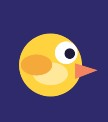
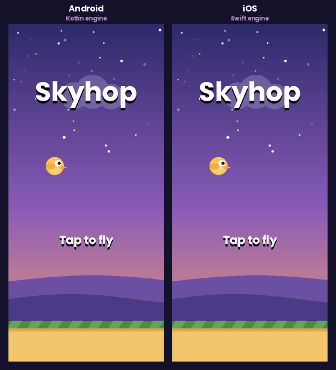

# Skyhop

A Flappy Bird style game, built natively twice: **Kotlin + Jetpack Compose** on Android and **Swift + SwiftUI** on iOS.
Both apps share the same architecture, the same physics constants and the same test suite, so the two codebases can be compared side by side.


| Android | iOS |
| --- | --- |
|  |  |

### Same level, two engines

The GIF below comes from running the real Kotlin engine and the real Swift engine on the same seeded level, frame by frame.
Scores, crash time and every pipe match, and the bird position differs by less than 0.003 px.



## Features

- Custom game loop driven by the display refresh (Compose frame clock on Android, `CADisplayLink` at up to 120 Hz on iOS)
- Physics, procedural pipe generation and circle vs rectangle collision detection
- Everything drawn in code on a canvas: dusk sky with twinkling stars, parallax clouds and hills, scrolling ground, animated bird
- Persistent high score (DataStore on Android, UserDefaults on iOS)
- Auto pause when the app goes to the background, restart delay after a crash
- Haptic feedback on score and crash
- English and Greek localization

## Architecture

```
┌──────────────────────────┐     ┌──────────────────────────┐
│  UI (Compose / SwiftUI)  │     │  Platform services       │
│  Canvas renderer + HUD   │     │  DataStore, UserDefaults │
└────────────┬─────────────┘     └────────────┬─────────────┘
             │ state                          │
┌────────────▼────────────────────────────────▼─────────────┐
│  ViewModel: frame ticks in, snapshots and events out      │
└────────────┬──────────────────────────────────────────────┘
             │ tap() / update(dt)
┌────────────▼──────────────────────────────────────────────┐
│  Core engine (pure Kotlin module / Swift package)         │
│  No Android or UIKit imports, fully unit tested           │
└───────────────────────────────────────────────────────────┘
```

The engine lives in its own module (`android/core`, a plain Kotlin/JVM module) and its own Swift package (`ios/SkyhopCore`).
It knows nothing about pixels, views or frameworks: it receives taps and frame times and returns an immutable `GameState` plus one-off `GameEvent`s (flap, score, hit, new best).

| Concern | Android | iOS |
| --- | --- | --- |
| UI | Jetpack Compose, `Canvas` | SwiftUI, `Canvas` |
| Game loop | `withFrameNanos` in a `LaunchedEffect` | `CADisplayLink` (ProMotion 120 Hz) |
| State | `mutableStateOf` in a `ViewModel` | `@Observable` view model |
| Persistence | DataStore Preferences | UserDefaults |
| Lifecycle | `LifecycleEventEffect(ON_PAUSE)` | `scenePhase` |
| Haptics | `LocalHapticFeedback` | `.sensoryFeedback` |
| Tests | JUnit, pure JVM | XCTest, `swift test` |

## Design decisions worth talking about

- **World units instead of pixels.** The world is always 1.0 tall and its width follows the aspect ratio. Gravity, speeds and sizes are expressed in those units, so the game feels identical on a small phone, a tablet or in landscape.
- **Frame time clamping.** `dt` is capped at 1/30 s. A dropped frame or returning from the background never teleports the bird through a pipe.
- **Pipes at exact spacing.** New pipes are placed at `last.x + spacing`, not "when a timer fires", so spacing never drifts with frame rate, and every pipe is created off screen.
- **Always beatable levels.** The vertical distance between consecutive gaps is limited. A unit test runs a small bot for two minutes on four screen shapes and ten seeds to prove every level can be cleared.
- **Only redraw what changes.** On Android the Canvas reads the state inside the draw lambda, so each frame skips composition and layout and only redraws. The score overlay uses `derivedStateOf` and recomposes only when the score or phase changes. On iOS the canvas and the overlay are separate views, and the overlay observes a small `HudState` that changes a few times per game.
- **No retain cycle in the display link.** `CADisplayLink` retains its target strongly, so a small proxy holds the owner weakly and invalidates the link by itself if the owner goes away.
- **React on touch down.** Both platforms flap on finger down instead of on release, which removes around 100 ms of perceived latency.

## Tests

| Suite | Tests | Covers |
| --- | --- | --- |
| Android `core` (JUnit) | 26 | physics, clamping, collision, scoring, spawning, best score, pause/restart, playability bot |
| iOS `SkyhopCore` (XCTest) | 27 | the same scenarios, plus UserDefaults persistence |

```bash
# Android engine tests
cd android && ./gradlew :core:test

# iOS engine tests (macOS or Linux)
cd ios/SkyhopCore && swift test
```

## Getting started

**Android:** open the `android` folder in Android Studio (Narwhal 3 Feature Drop or newer), wait for Gradle sync, run the `app` configuration.
Requires JDK 17+, compileSdk 36, minSdk 26.

**iOS:** open `ios/Skyhop.xcodeproj` in Xcode 16 or newer and run the `Skyhop` scheme on a simulator or device.
For a real device, pick your team under Signing & Capabilities. Requires iOS 17+.

The Xcode project is generated from `ios/project.yml` with [XcodeGen](https://github.com/yonaskolb/XcodeGen). You only need XcodeGen if you add or move files (`xcodegen generate`).

## Project structure

```
android/
  core/   Pure Kotlin engine + JUnit tests
  app/    Compose UI, renderer, ViewModel, DataStore
ios/
  SkyhopCore/          Swift package: engine + XCTest tests
  Skyhop/              SwiftUI app: renderer, display link, view model
  Skyhop.xcodeproj
  project.yml          XcodeGen spec
.github/workflows/ci.yml   Runs both test suites and builds both apps
```

## Ideas for next steps

- Sound effects with `SoundPool` / `AVAudioPlayer`
- Medals and a leaderboard (Play Games Services / Game Center)
- Share the engine with Kotlin Multiplatform instead of two implementations

## License

MIT. "Flappy Bird" is a trademark of its respective owner, this is an independent learning project with original art.
